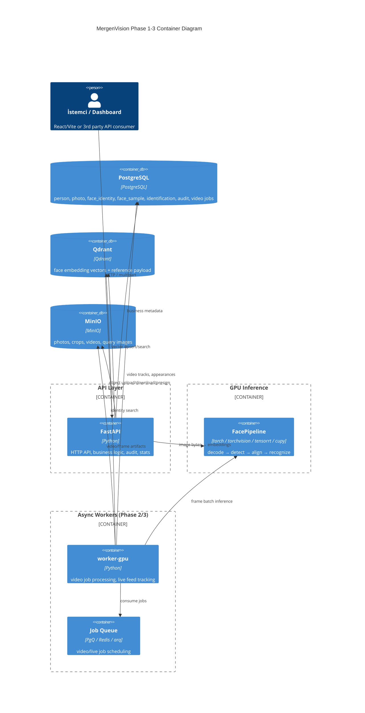

# High-Level Container Diagram

```mermaid
C4Container
    title MergenVision Phase 1-3 Container Diagram

    Person(user, "İstemci / Dashboard", "React/Vite or 3rd party API consumer")

    Container_Boundary(api, "API Layer") {
        Container(fastapi, "FastAPI", "Python", "HTTP API, business logic, audit, stats")
    }

    Container_Boundary(gpu, "GPU Inference") {
        Container(facepipeline, "FacePipeline", "torch / torchvision / tensorrt / cupy", "decode → detect → align → recognize")
    }

    Container_Boundary(workers, "Async Workers (Phase 2/3)") {
        Container(worker, "worker-gpu", "Python", "video job processing, live feed tracking")
        Container(queue, "Job Queue", "PgQ / Redis / arq", "video/live job scheduling")
    }

    ContainerDb(postgres, "PostgreSQL", "PostgreSQL", "person, photo, face_identity, face_sample, identification, audit, video jobs")
    ContainerDb(qdrant, "Qdrant", "Qdrant", "face embedding vectors + reference payload")
    ContainerDb(minio, "MinIO", "MinIO", "photos, crops, videos, query images")

    Rel(user, fastapi, "HTTP / multipart")
    Rel(fastapi, facepipeline, "image bytes → embeddings")
    Rel(fastapi, postgres, "business metadata")
    Rel(fastapi, qdrant, "vector upsert/search")
    Rel(fastapi, minio, "object upload/download/presign")
    Rel(worker, facepipeline, "frame batch inference")
    Rel(worker, queue, "consume jobs")
    Rel(worker, postgres, "video tracks, appearances")
    Rel(worker, qdrant, "identity search")
    Rel(worker, minio, "video/frame artifacts")
```
