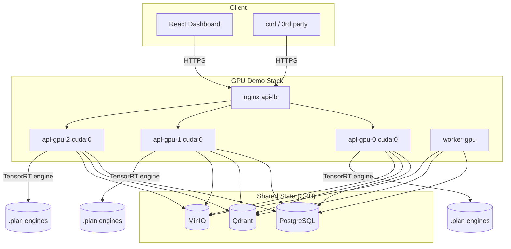

# Dockerized GPU Deployment

```mermaid
flowchart TB
    subgraph Client["Client"]
        WEB[React Dashboard]
        CLI[curl / 3rd party]
    end

    subgraph GPU["GPU Demo Stack"]
        NGINX[nginx api-lb]
        API0[api-gpu-0 cuda:0]
        API1[api-gpu-1 cuda:0]
        API2[api-gpu-2 cuda:0]
        WORKER[worker-gpu]
    end

    subgraph Shared["Shared State (CPU)"]
        PG[(PostgreSQL)]
        QD[(Qdrant)]
        MN[(MinIO)]
    end

    WEB -->|HTTPS| NGINX
    CLI -->|HTTPS| NGINX
    NGINX --> API0
    NGINX --> API1
    NGINX --> API2

    API0 --> PG & QD & MN
    API1 --> PG & QD & MN
    API2 --> PG & QD & MN
    WORKER --> PG & QD & MN

    API0 -->|TensorRT engine| ENG0[(.plan engines)]
    API1 -->|TensorRT engine| ENG1[(.plan engines)]
    API2 -->|TensorRT engine| ENG2[(.plan engines)]
```
