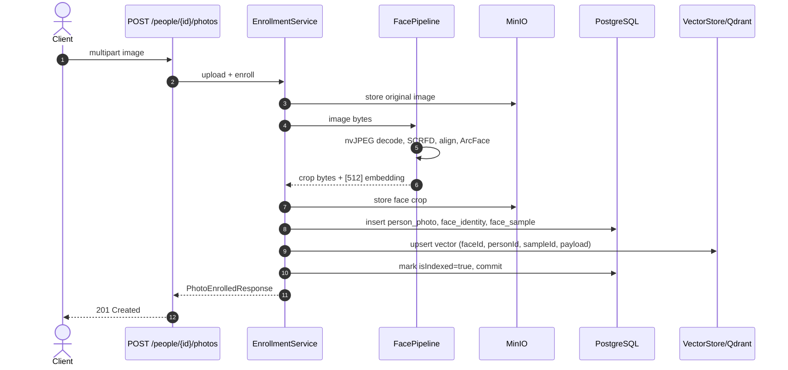

# Enrollment Sequence

```mermaid
sequenceDiagram
    autonumber
    actor C as Client
    participant R as POST /people/{id}/photos
    participant S as EnrollmentService
    participant P as FacePipeline
    participant ST as MinIO
    participant DB as PostgreSQL
    participant VS as VectorStore/Qdrant

    C->>R: multipart image
    R->>S: upload + enroll
    S->>ST: store original image
    S->>P: image bytes
    P->>P: nvJPEG decode, SCRFD, align, ArcFace
    P-->>S: crop bytes + [512] embedding
    S->>ST: store face crop
    S->>DB: insert person_photo, face_identity, face_sample
    S->>VS: upsert vector (faceId, personId, sampleId, payload)
    S->>DB: mark isIndexed=true, commit
    S-->>R: PhotoEnrolledResponse
    R-->>C: 201 Created
```
