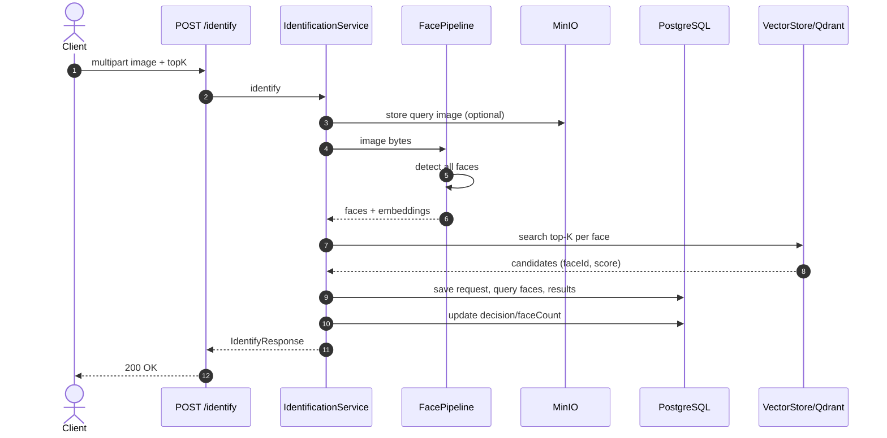

# Identify Sequence

```mermaid
sequenceDiagram
    autonumber
    actor C as Client
    participant R as POST /identify
    participant S as IdentificationService
    participant P as FacePipeline
    participant ST as MinIO
    participant DB as PostgreSQL
    participant VS as VectorStore/Qdrant

    C->>R: multipart image + topK
    R->>S: identify
    S->>ST: store query image (optional)
    S->>P: image bytes
    P->>P: detect all faces
    P-->>S: faces + embeddings
    S->>VS: search top-K per face
    VS-->>S: candidates (faceId, score)
    S->>DB: save request, query faces, results
    S->>DB: update decision/faceCount
    S-->>R: IdentifyResponse
    R-->>C: 200 OK
```
