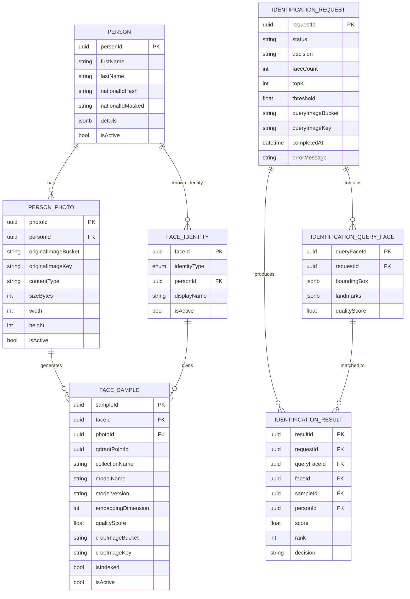

# Phase 1 Entity Relationship Diagram

```mermaid
erDiagram
    PERSON ||--o{ PERSON_PHOTO : has
    PERSON ||--o{ FACE_IDENTITY : "known identity"
    PERSON_PHOTO ||--o{ FACE_SAMPLE : "generates"
    FACE_IDENTITY ||--o{ FACE_SAMPLE : "owns"

    IDENTIFICATION_REQUEST ||--o{ IDENTIFICATION_QUERY_FACE : contains
    IDENTIFICATION_REQUEST ||--o{ IDENTIFICATION_RESULT : produces
    IDENTIFICATION_QUERY_FACE ||--o{ IDENTIFICATION_RESULT : "matched to"

    PERSON {
        uuid personId PK
        string firstName
        string lastName
        string nationalIdHash
        string nationalIdMasked
        jsonb details
        bool isActive
    }

    PERSON_PHOTO {
        uuid photoId PK
        uuid personId FK
        string originalImageBucket
        string originalImageKey
        string contentType
        int sizeBytes
        int width
        int height
        bool isActive
    }

    FACE_IDENTITY {
        uuid faceId PK
        enum identityType
        uuid personId FK
        string displayName
        bool isActive
    }

    FACE_SAMPLE {
        uuid sampleId PK
        uuid faceId FK
        uuid photoId FK
        uuid qdrantPointId
        string collectionName
        string modelName
        string modelVersion
        int embeddingDimension
        float qualityScore
        string cropImageBucket
        string cropImageKey
        bool isIndexed
        bool isActive
    }

    IDENTIFICATION_REQUEST {
        uuid requestId PK
        string status
        string decision
        int faceCount
        int topK
        float threshold
        string queryImageBucket
        string queryImageKey
        datetime completedAt
        string errorMessage
    }

    IDENTIFICATION_QUERY_FACE {
        uuid queryFaceId PK
        uuid requestId FK
        jsonb boundingBox
        jsonb landmarks
        float qualityScore
    }

    IDENTIFICATION_RESULT {
        uuid resultId PK
        uuid requestId FK
        uuid queryFaceId FK
        uuid faceId FK
        uuid sampleId FK
        uuid personId FK
        float score
        int rank
        string decision
    }
```
