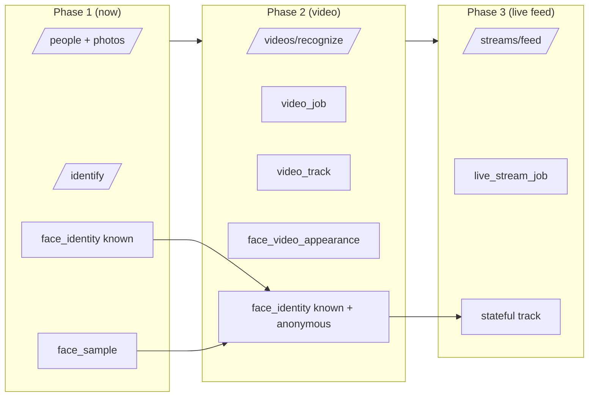

# Phase 1 → 2 → 3 Evolution

```mermaid
flowchart LR
    subgraph P1["Phase 1 (now)"]
        A1[/people + photos/]
        A2[/identify/]
        A3[face_identity known]
        A4[face_sample]
    end

    subgraph P2["Phase 2 (video)"]
        B1[/videos/recognize/]
        B2[video_job]
        B3[video_track]
        B4[face_video_appearance]
        B5[face_identity known + anonymous]
    end

    subgraph P3["Phase 3 (live feed)"]
        C1[/streams/feed/]
        C2[live_stream_job]
        C3[stateful track]
    end

    A3 --> B5
    A4 --> B5
    B5 --> C3
    P1 --> P2 --> P3
```
