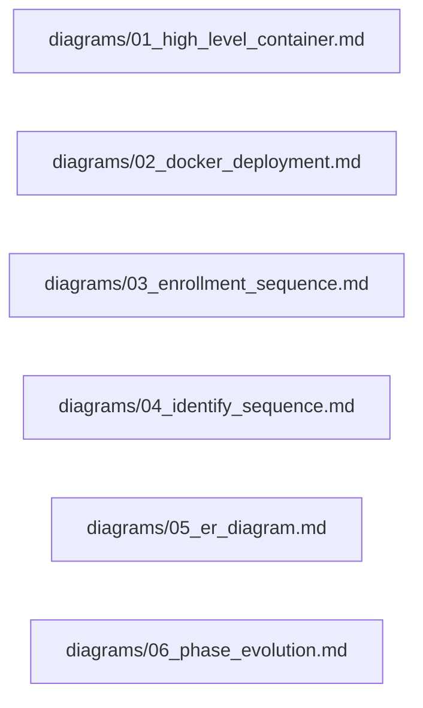

# MergenVision — Diagram Index

All diagrams are Mermaid and stored in `diagrams/`.

| File | Description |
|---|---|
| `diagrams/01_high_level_container.md` | C4 container view of API, GPU pipeline, workers, PostgreSQL, Qdrant, MinIO |
| `diagrams/02_docker_deployment.md` | Dockerized GPU demo stack with nginx lb and shared services |
| `diagrams/03_enrollment_sequence.md` | End-to-end photo upload + enrollment sequence |
| `diagrams/04_identify_sequence.md` | End-to-end identification sequence |
| `diagrams/05_er_diagram.md` | Phase 1 entity relationship diagram |
| `diagrams/06_phase_evolution.md` | Phase 1 → Phase 2 (video) → Phase 3 (live feed) evolution |

