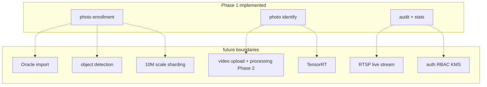
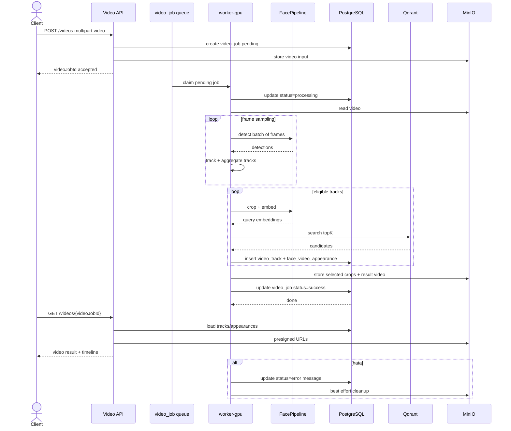

# Future Boundaries

MergenVision Phase 0 ve Phase 1, iyi tanımlanmış sınırlar içinde kalır. Aşağıdaki konular Phase 1 sonrası veya Phase 2'de ele alınır; şu an implemente edilmez.

## Future Boundaries Map

## Oracle Import Boundary

**Ne zaman:** Phase 1 sonrası veya Phase 2 başlangıcında.

- Oracle veritabanından kişi/fotoğraf çekme endpoint'leri (`/imports/*`) Phase 1'de yoktur.
- Phase 1'de seed data manuel veya test script ile sağlanır.
- Import, adapte edilmiş bir `ImportService` ve async worker ile yapılacaktır.
- Oracle bağlantısı runtime bağımlılığı değildir; import işlemi ayrı bir profil/worker ile çalışır.

## Phase 2 Video Boundary

**Ne zaman:** Phase 2.

- `POST /videos` upload endpoint.
- `GET /videos/{videoJobId}` durum ve sonuç.
- `video_job` PostgreSQL kuyruğu.
- `worker-gpu` container'ları frame sampling, batched detection, tracking, embedding çıkarımı, Qdrant search yapar.
- Sonuçlar `video_track` ve `face_video_appearance` tablolarına yazılır.
- Phase 2; aynı `person`, `person_photo`, `face_sample` ve Qdrant koleksiyonlarını kullanır.

## Object Detection Boundary

- Genel nesne tespiti (araç, plaka, silah vb.) MergenVision'un Phase 1/2 yüz odaklı pipeline'ının dışındadır.
- İleride eklenirse ayrı model pipeline'ı ve ayrı Qdrant koleksiyonu olur.

## TensorRT Boundary

- TensorRT optimizasyonu ONNX Runtime CUDAExecutionProvider'dan sonra değerlendirilir.
- Phase 0/1'de model shape/provider doğrulaması önceliklidir.
- TensorRT için model conversion, session yönetimi ve hata rejimi ayrıca incelenir.

## Auth / RBAC / KMS Boundary

- Phase 1'de production RBAC, çoklu tenant ve KMS ile anahtar yönetimi yoktur.
- Demo/test ortamında basit API key veya JWT değerlendirilebilir ancak production özellik değildir.
- 10M ölçek, sharding ve multitenancy Phase 1 sonrasıdır.

## 10M Scale Boundary

- Production 10 milyon+ kayıt ölçeği Phase 1'de hedeflenmez.
- Mevcut tasarım tek PostgreSQL/Qdrant/MinIO cluster üzerinde büyümeyi destekler ancak sharding/federation ileride değerlendirilir.

## Future Phase 2 Video Sequence

**Açıklama:** Video akışı Phase 1 fotoğraf akışının üzerine eklenir. Video worker aynı `FacePipeline`, aynı Qdrant koleksiyonları ve aynı MinIO object prefix stratejisini kullanır. Video özelleşmiş tablolar (`video_job`, `video_track`, `face_video_appearance`) aynı PostgreSQL şemasına eklenir.

## What Should Not Be Implemented Now

- `docker-compose.yml` yazımı.
- `/imports/*`, `/videos/*` endpoint'leri.
- Async worker implementasyonu.
- Video decoder/RTSP pipeline.
- Object detection pipeline.
- TensorRT conversion.
- RBAC/KMS.
- 10M sharding.
- Production monitoring stack.
- Model inference kodu Phase 0'da yoktur.

## Transition to Phase 2

Phase 2 planlaması Phase 1 onaylandıktan sonra başlar. Phase 1 platformu zaten Phase 2'nin ihtiyaç duyduğu tablo ve koleksiyonları kapsayacak şekilde genişletilebilir.
