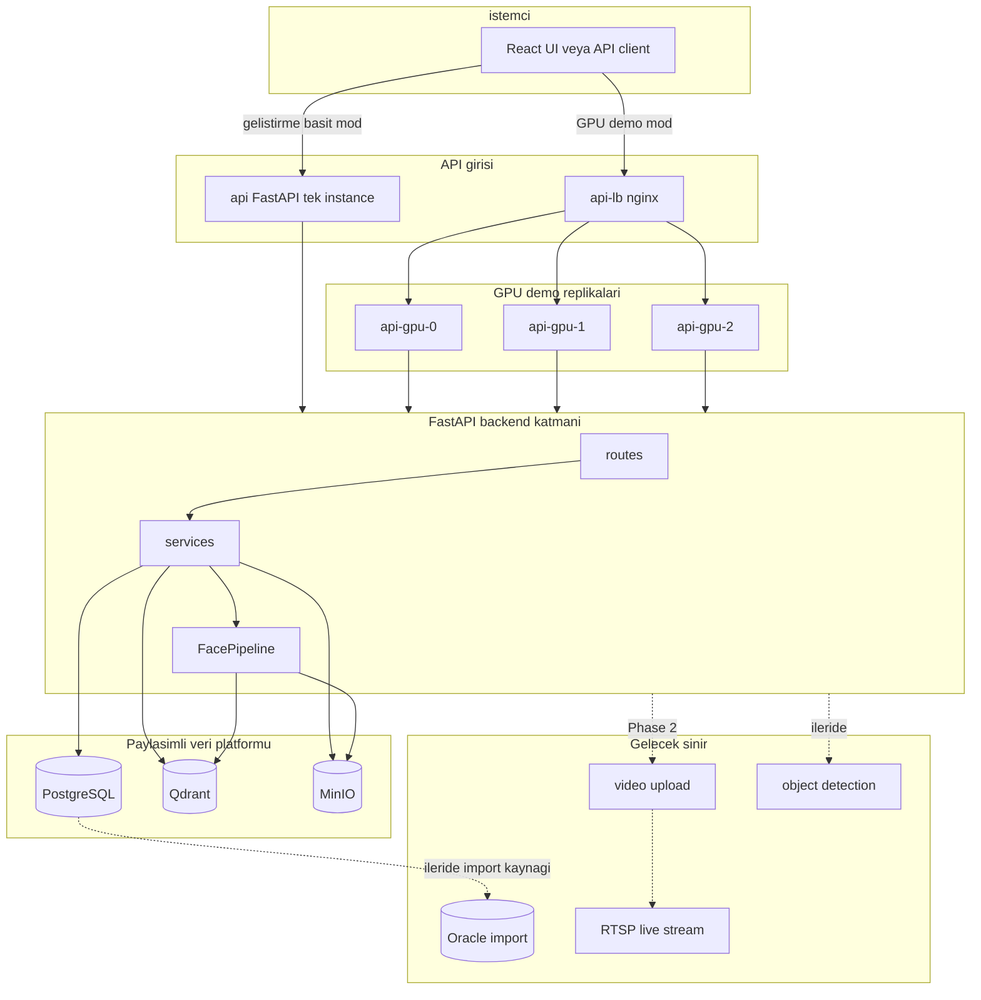
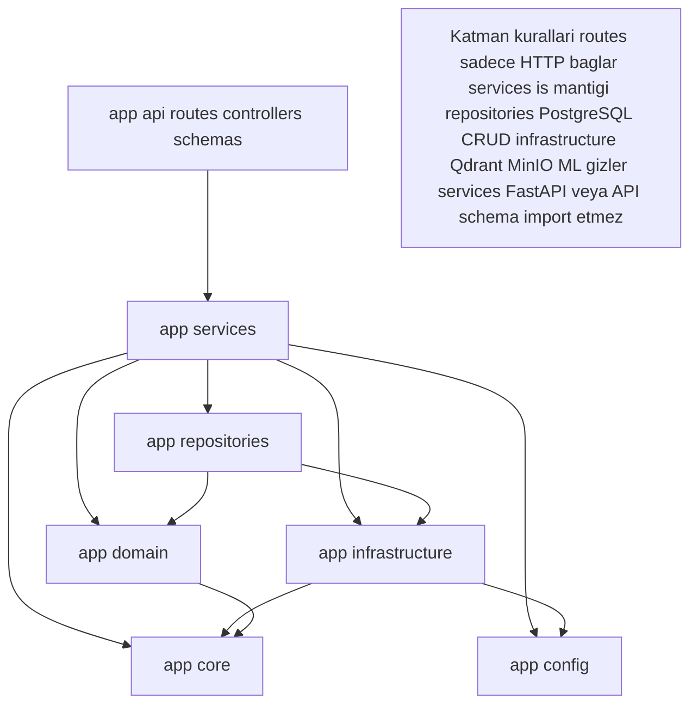

# High-Level Architecture

MergenVision, Phase 1'de fotoğraf tabanlı kişi tanıma, Phase 2'de ise aynı kimlik verilerini kullanan video tabanlı tanıma sunar. Her iki phase de **tek bir paylaşımlı veri platformu** üzerinde çalışır; ayrı kalıcı PostgreSQL/Qdrant/MinIO stack yoktur.

> **Önemli:** Phase 1 ve Phase 2 aynı mantıksal PostgreSQL, aynı Qdrant ve aynı MinIO servislerini kullanır. Kalıcı olarak ayrılmış Phase 1 / Phase 2 veri stack'i tasarlanmamıştır.

## Combined Phase 1 + Phase 2 High-Level Architecture

**Açıklama:**

- **Client:** React UI veya herhangi bir API consumer. İki erişim yolu vardır.
- **api:** Geliştirme/test/düşük kaynaklı ortamlar için tek instance FastAPI.
- **api-lb:** GPU demo modunda nginx yük dengeleyici.
- **api-gpu-0/1/2:** Aynı backend imajını ve aynı kodu çalıştıran GPU replikaları. Her biri fiziksel bir GPU'ya sabitlenir; Python kodu GPU UUID bilmez.
- **services:** İş mantığı; PostgreSQL, Qdrant, MinIO adaptörlerini ve `FacePipeline`'ı koordine eder.
- **FacePipeline:** ML adımlarını (validation, detection, alignment, embedding) adapter boundary üzerinden çalıştırır.
- **PostgreSQL:** Kişi, fotoğraf metadata, sample metadata, istek geçmişi, sonuçlar, audit log ve gelecekte video job/track/appearance verileri.
- **Qdrant:** Yüz embedding vektörleri ve referans payload.
- **MinIO:** Orijinal görüntüler, crop'lar, sorgu görüntüleri ve gelecekte video artefaktları.
- **Future:** Oracle import, video upload, RTSP, genel nesne tespili mimaride yer alır ama Phase 1'de implemente edilmez.

## Backend Layering Diagram

**Açıklama:**

- **app/api:** FastAPI router'ları, controller'lar, Pydantic şemalar. İş mantığı içermez.
- **app/services:** PersonService, PersonPhotoService, IdentificationService, AuditService gibi iş mantığı servisleri.
- **app/repositories:** PostgreSQL CRUD operasyonları; her domain entity için bir repository.
- **app/infrastructure:** VectorStore (Qdrant), ImageStorage (MinIO), FacePipeline (ONNX Runtime adapter'ları), DB bağlantı modelleri.
- **app/domain:** Temel domain modelleri ve enum'lar. Harici bağımlılık içermez.
- **app/core:** AppError hiyerarşisi, maskeleme/hash yardımcıları.
- **app/config:** Ortam değişkenleri ve model konfigürasyonu.
- **Dependency rule:** Yukarıdan aşağıya (API → services → repositories/infrastructure/domain → core) bağımlılık vardır; tersi yoktur.

## Dev / Simple Mode vs GPU Demo Mode

| Mod | Yapı | Amaç |
|---|---|---|
| **Dev / Simple** | Client → `api` (tek instance) → PostgreSQL/Qdrant/MinIO | Geliştirme, test, düşük kaynaklı demo. |
| **GPU Demo** | Client → `api-lb` → `api-gpu-0/1/2` → aynı PostgreSQL/Qdrant/MinIO | Çoklu GPU inference demo; aynı kod farklı container'larda çalışır. |
| **Production-later** | Orchestrator (örn. Kubernetes) + service mesh; GPU scheduling ortam/env üzerinden | Yük dengeleme ve GPU atama Python yerine orchestrator'a bırakılır. |

GPU demo modda `api-gpu-*` container'ları aynı kodu çalıştırır. Fiziksel GPU sabitlemesi sadece docker-compose (veya eşdeğeri orchestrator) tanımı ile yapılır; uygulama kodu GPU UUID veya sabit indeks içermez.

## Future Boundaries

- **Oracle import:** Sadece ilerideki harici veri kaynağı; Phase 1 runtime bağımlılığı değildir.
- **Video / RTSP:** Phase 2 sınırı; mevcut Phase 1 fotoğraf akışını değiştirmez.
- **Object detection:** Genel nesne tespiti Phase 2 sonrası düşünülür; yüz odaklı pipeline dışında kalır.
