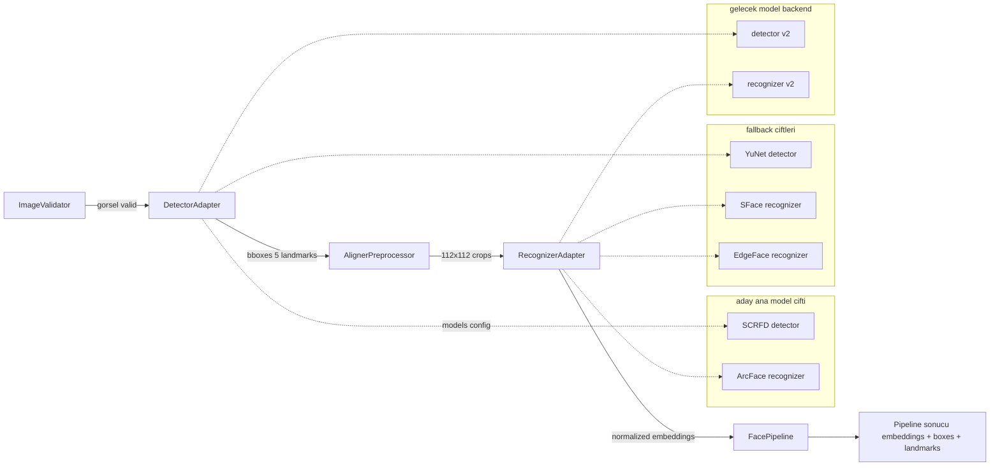

# Model Adapter Boundary

MergenVision, yüz analizi pipeline'ını bağımsız, değiştirilebilir adapter'lerden oluşturur. Amaç:

- Bugün için SCRFD + ArcFace adaylarını desteklemek.
- Gerektiğinde YuNet/SFace veya başka bir detector/recognizer çiftine geçiş yapabilmek.
- Phase 1 kimlik verilerinin (`person`, `person_photo`, `face_sample`) model değişiminden etkilenmemesini sağlamak.

## Model Adapter Boundary Diagram



**Açıklama:**

- `ImageValidator` — format, boyut, kanal, bozuk görüntü kontrolü.
- `DetectorAdapter` — sadece yüz tespiti; çıkış bbox + score + landmarks.
- `AlignerPreprocessor` — 5 nokta landmark'dan doğrusal transform ile `112x112` crop üretir.
- `RecognizerAdapter` — crop'dan embedding vektörü çıkarır.
- `FacePipeline` — yukarıdaki adımları bir araya getirir; iş mantığı değil ML orkestrasyonu yapar.
- Business servisler (`EnrollmentService`, `IdentificationService`) pipeline sonucuna göre karar verir.

## DetectorAdapter Interface Concept

```text
interface DetectorAdapter:
    load(model_path, providers, options)
    detect(image_or_gpu_batch) -> DetectionBatch
    name -> str
    version -> str
    input_shape -> tuple
    output_spec -> dict
```

Sorumluluklar:

- Kendi ONNX Runtime session'ını ve IOBinding'ini yönetir.
- Giriş tensor şekli ile ilgili varsayımları açıkça belirtir.
- Çıkışı generic bbox/landmark/score listesine çevirir; sonraki katmanlara model-özel tensör göndermez.

## RecognizerAdapter Interface Concept

```text
interface RecognizerAdapter:
    load(model_path, providers, options)
    embed(aligned_crops) -> EmbeddingBatch
    embedding_dimension -> int
    name -> str
    version -> str
```

Sorumluluklar:

- Crop input'un doğru normalize edildiğini kabul eder.
- Çıkış embedding'lerini L2 normalize edip etmediğini açıkça belirtir.
- `embedding_dimension` değerini verir; bu değer Qdrant koleksiyon isminde kullanılır.

## AlignerPreprocessor Concept

```text
class AlignerPreprocessor:
    estimate_similarity_transform(landmarks, template) -> affine_matrix
    warp(image, affine_matrix, output_size=112) -> aligned_crop
```

- 5 noktalı landmark sırası model tarafından belirlenir; adapter bunu açıklar.
- ArcFace template `112x112` için InsightFace `arcface_dst` kullanılır.
- İlk implementasyonda CPU üzerinde transform hesabı, GPU/CPU crop örneklemesi yapılabilir.

## FacePipeline Orchestration

```text
FacePipeline:
    validate(image) -> bool
    detect(image) -> DetectionBatch
    enroll(image) -> (photo, sample_list)
    identify(image, top_k) -> (query_faces, results)
```

`FacePipeline`, ML adımlarını sıralar. Şunları bilmez:

- `personId`, `nationalId`, `requestId` gibi iş kavramları.
- Qdrant collection ismi veya MinIO bucket adı.
- Audit log veya yetkilendirme.

Bu bilgileri `EnrollmentService` ve `IdentificationService` yönetir.

## Pipeline Varyasyonları

- **OnlineIdentifyPipeline** — tek sorgu görüntüsü, tek seferlik detect + embed + search.
- **EnrollmentPipeline** — fotoğrafı alır, her yüz için detect + align + embed + MinIO upload metadata döner.
- **FutureBatchEnrollmentPipeline** — Phase 1 sonrası, çoklu fotoğrafın batch'li işlenmesi. Yalnızca performans optimizasyonu.
- **FutureVideoRecognitionPipeline** — Phase 2, frame sampling + batched detect + track + selected crop embed + Qdrant search.

**Önemli:** Batch support bir iş/domain bağımlılığı değil, performans detayıdır. Tüm pipeline'lar tekli inference yolunu da destekler.

## Model Registry / Config

Model seçimi ortam değişkenleri veya config dosyasından gelir. Örnek yapı:

```yaml
models:
  detector:
    name: scrfd_10g_320
    version: batch
    path: /models/scrfd_10g_320_batch.onnx
    input_shape: [batch, 3, 320, 320]
  recognizer:
    name: arcface_w600k_r50
    version: batch
    path: /models/arcface_w600k_r50_batch.onnx
    input_shape: [batch, 3, 112, 112]
    embedding_dimension: 512
    normalized: false
  aligner:
    template: arcface_112
```

- Kodda model path'ine doğrudan erişilmez; registry üzerinden.
- `embedding_dimension` hem `face_sample` tablosunda hem Qdrant koleksiyon isminde kullanılır.

## Vector Dimension Strategy

Qdrant koleksiyonları, embedding boyutuna ve model adına göre ayrılır.

Örnek koleksiyon isimleri:

- `face_samples_arcface_512_v1`
- `face_samples_sface_128_v1`

Kurallar:

- Aynı collection içinde farklı boyuta sahip vektörler karıştırılmaz.
- Model değiştiğinde yeni collection açılır; eski collection ve sample'lar read-only kalabilir veya migration ile taşınır.
- `face_sample` tablosundaki `modelName/modelVersion/embeddingDimension` ile Qdrant point arasında tutarlılık sağlanır.

## Model Replacement Strategy

1. Yeni detector/recognizer adapter'ı implemente edilir.
2. Yeni model konfigürasyonu eklenir (örn. `sface_yunet`).
3. Yeni Qdrant collection'ı oluşturulur.
4. Enrollment yeni koleksiyona yazılır.
5. Eski koleksiyon ve sample'lar, eski sorgular için yedekte kalır.
6. Phase 2 video pipeline'ı da yeni adapter'ları kullanabilir.

Kimlik verileri (`PERSON`, `PERSON_PHOTO`, `FACE_SAMPLE`) korunur; sadece `modelName`, `modelVersion`, `embeddingDimension`, `qdrantPointId` ve koleksiyon adı değişir.

## Phase 2 Quality-Risk Mitigation

Eğer SCRFD + ArcFace Phase 2 video senaryosunda yetersiz kalırsa:

- DetectorAdapter yenisiyle değiştirilir (örn. daha büyük input şekli).
- RecognizerAdapter yenisiyle değiştirilir (örn. EdgeFace/SFace).
- Yeni adapter'lar için ayrı Qdrant koleksiyonu açılır.
- Video worker'lar aynı `person`/`face_sample` tablolarına yazar; ancak yeni model için yeni `FACE_SAMPLE` satırları üretir.
- Phase 1 gallery'si (ArcFace koleksiyonu) ve Phase 2 gallery'si (yeni koleksiyon) aynı anda tutulabilir; istemciye hangi koleksiyonun aranacağı konfigürasyondan bildirilir.

## Açık Beyan

> **Batch support is a performance feature, not a business-domain dependency.**
> 
> SCRFD/ArcFace batch modelleri Phase 0B'de doğrulanana kadar adaydır. Eğer Phase 2'de SCRFD + ArcFace kalitesi yeterli olmazsa, adapter ve Qdrant koleksiyonları değiştirilebilir; `person`, `person_photo`, `face_sample` iş tabloları ve kimlik ilişkileri değişmez.

## Unverified Claims

- SCRFD ve ArcFace ONNX çıkış şekilleri ve normalize davranışları henüz MergenVision'da doğrulanmadı.
- ONNX Runtime CUDAExecutionProvider + IOBinding entegrasyonu Phase 0B'de test edilecek.
- Batch inference'daki contamination-free davranış ve doğru NMS/crop akışı Phase 0B'ye kadar kanıtlanmamıştır.
