# Phase 1 / Phase 2 Shared Data Platform

MergenVision'da Phase 1 ve Phase 2, **mantıksal olarak tek bir veri platformu** üzerinde çalışır. Bu platform:

- Tek PostgreSQL
- Tek Qdrant
- Tek MinIO

Ayırma; tablolar, koleksiyonlar ve object prefix'leri ile yapılır. Phase 1 ve Phase 2 için ayrı kalıcı veri stack'i yoktur.

> Geçici Phase 2 lab stack'i geliştirme/test için izin verilir; final mimarideki tek platformun yerini almaz.

## Shared Data Platform Separation Diagram

```mermaid
flowchart TD
    subgraph Postgres [MergenVision PostgreSQL]
        P1[PERSON tablosu]
        P2[PERSON_PHOTO tablosu]
        P3[FACE_SAMPLE tablosu]
        P4[IDENTIFICATION_REQUEST tablosu]
        P5[AUDIT_LOG tablosu]
        P6["Gelecek Phase 2: video_job, video_track, face_video_appearance"]
    end

    subgraph Qdrant [MergenVision Qdrant]
        Q1["Koleksiyon: face_samples_arcface_512_v1"]
        Q2["Koleksiyon: face_samples_sface_128_v1"]
        Q3["Gelecek: video detection snapshot collection"]
    end

    subgraph Minio [MergenVision MinIO]
        M1["bucket/prefix: originals"]
        M2["bucket/prefix: crops"]
        M3["bucket/prefix: query-images"]
        M4["Gelecek: bucket/prefix: video-input"]
        M5["Gelecek: bucket/prefix: video-output"]
    end

    subgraph Phase1Apps [Phase 1 uygulamalari]
        API[FastAPI api]
    end

    subgraph Phase2Apps [Phase 2 uygulamalari]
        VW[worker-gpu video]
    end

    API --> P1
    API --> P2
    API --> P3
    API --> P4
    API --> P5
    API --> Q1
    API --> Q2
    API --> M1
    API --> M2
    API --> M3

    VW --> P1
    VW --> P2
    VW --> P3
    VW --> P6
    VW --> Q1
    VW --> Q2
    VW --> M1
    VW --> M4
    VW --> M5

    NO["Kalici ayrı Phase1 Phase2 stack yoktur"]
```



## Neden Ayrı Kalıcı Stack Değil?

Eğer Phase 1 ve Phase 2 ayrı PostgreSQL/Qdrant/MinIO kullanırsa:

- Aynı kişinin Phase 1 fotoğrafı ile Phase 2 video eşleşmesi için sürekli senkronizasyon gerekir.
- `face_sample` ve Qdrant koleksiyonları çoğaltılır; model değişimleri iki yerde yönetilir.
- Audit izi kopar.
- Production'da iki sistemi birleştirmek migration riski yaratır.

Tek platform bu riskleri ortadan kaldırır; Phase 2, Phase 1 varlıklarını doğrudan kullanır.

## PostgreSQL Table Separation

Phase 1 tabloları:

- `person`
- `person_photo`
- `face_sample`
- `identification_request`
- `identification_query_face`
- `identification_result`
- `audit_log`

Phase 2'de eklenecek tablolar (aynı şema/db'de):

- `video_job`
- `video_track`
- `face_video_appearance`
- `video_frame_sample` (isteğe bağlı)

`face_video_appearance` `personId` ve `face_sample` ile ilişkilendirilir; böylece video görünümü bilinen bir kimlikle bağlanır.

## Qdrant Collection Strategy

Ayırma koleksiyon adları ile yapılır:

```text
{entity}_{model}_{dimension}_{version}
```

Örnekler:

- `face_samples_arcface_512_v1`
- `face_samples_sface_128_v1`
- `video_snapshots_arcface_512_v1` (Phase 2'de)

Aynı koleksiyon farklı modellerin vektörlerini barındırmaz. Phase 2, Phase 1 gallery koleksiyonlarını arayabilir veya yeni model koleksiyonu açabilir; her iki durumda da `personId` referansı aynıdır.

## MinIO Prefix Strategy

Önerilen prefix yapısı:

```text
mergenvision/
  originals/{personId}/{photoId}/...
  crops/{personId}/{photoId}/{sampleId}/...
  query-images/{requestId}/{queryFaceId}/...
  video-input/{videoJobId}/...
  video-output/{videoJobId}/...
```

Bucket adı ortam bazlı değişebilir (`mergenvision-dev`, `mergenvision-prod`), object key prefix'leri aynı kalır.

## Temporary Phase 2 Lab Stack

- Geliştirici, Phase 2 pipeline'ını izole test etmek için kendi bilgisayarında veya geçici bir sunucuda ayrı bir Qdrant/MinIO/PostgreSQL açabilir.
- Bu lab stack'i final mimari değildir; test bitince Phase 1 platformuna entegre edilir veya elde edilen model/adapter'lar tek platformda yeniden koşulur.
- Lab stack'indeki veri migration'ı kabul edilebilir; production'da ayrı stack migration'ı kabul edilemez.

## Merge / Migration Risk

| Senaryo | Risk | Karar |
|---|---|---|
| Phase 1 ayrı DB, Phase 2 ayrı DB | Production merge zor, tutarsızlık riski | reddedildi |
| Tek DB, Phase 2 tabloları eklenir | Düşük risk, doğal genişleme | kabul edildi |
| Tek Qdrant, farklı koleksiyonlar | Koleksiyon yönetimi gerekir ama veri kaybı yok | kabul edildi |
| Tek MinIO, prefix ayrımı | Sıfır merge riski | kabul edildi |

## Implementation Note

- Docker Compose dosyası Phase 0'da yazılmaz.
- Uygulama kodu her zaman tek PostgreSQL, tek Qdrant, tek MinIO çiftini varsayar.
- Lab ortamı ayrıysa bunu yalnızca farklı connection string'lerle çözer; kod değişmez.
