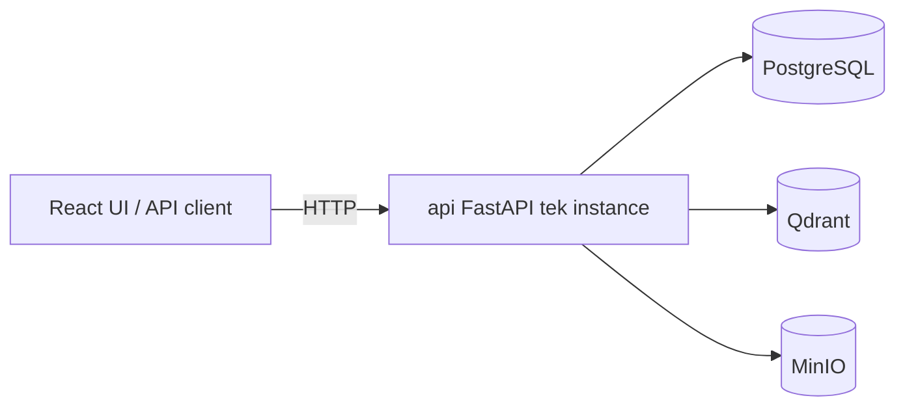
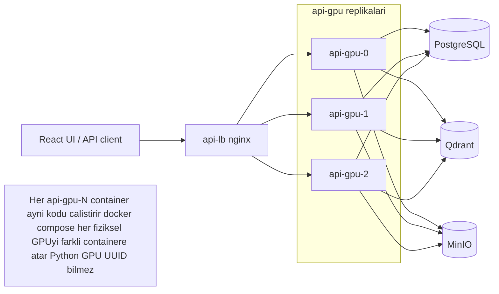

# Runtime Topology

MergenVision üç runtime topolojisi tanımlar:

1. **Dev / Simple Mode** — tek instance API, CPU veya tek GPU.
2. **GPU Demo Mode** — nginx yük dengeleyici + `api-gpu-N` replikaları, her biri bir fiziksel GPU'ya sabit.
3. **Production-later Mode** — orchestrator (Kubernetes gibi) + env bazlı GPU scheduling.

Bu dokümanda **Docker Compose dosyası yazılmaz**; sadece topoloji ve ileride Compose'un/iş yükü orkestrasyonunun ihtiyaç duyacağı kavramlar tanımlanır.

## Dev / Simple Topology

**Açıklama:**

- API tek container'da çalışır.
- CPU inference veya Docker Compose dışında atanan tek GPU kullanabilir.
- PostgreSQL, Qdrant, MinIO aynı mantıksal hostta veya remote'ta olabilir.
- Geliştirme, test, düşük kaynaklı demo için uygundur.

## GPU Demo Topology

**Açıklama:**

- **api-lb:** nginx reverse proxy ve round-robin yük dengeleyici.
- **api-gpu-0/1/2:** Aynı backend imajı, aynı FastAPI kodu.
- Her container aynı anda yalnızca kendi atandığı fiziksel GPU'yu görür ve genellikle CUDA device 0 olarak görür.
- GPU UUID/device index sabitleme sadece Docker Compose (veya orchestrator) konfigürasyonundadır; Python kodunda sabit GPU UUID yoktur.
- Tüm replikalar aynı PostgreSQL/Qdrant/MinIO'ya bağlanır; durum veritabanında tutulur, replikalar stateless'tir.

## Production-Later Topology

Phase 1 ve GPU demo modda Docker Compose yeterlidir. Production için:

- Orchestrator (Kubernetes, ECS, vb.) api replikalarını yönetir.
- GPU atama `NVIDIA_VISIBLE_DEVICES`, `CUDA_VISIBLE_DEVICES` veya device plugin üzerinden env bazlı yapılır.
- Yük dengeleme orchestrator Ingress/service mesh'e bırakılır.
- Python kodu hâlâ GPU UUID bilmez.
- PostgreSQL/Qdrant/MinIO managed servis veya HA cluster olur.

## api-lb / nginx Rolü

- Gelen HTTP isteklerini `api-gpu-0`, `api-gpu-1`, `api-gpu-2` arasında dağıtır.
- Health check ile down olan replikayı devre dışı bırakır.
- `/health` ve `/ready` uçlarını da proxyler; readiness probe kaynağı API kendisidir.
- Statik medya servisi değildir; medya `GET /media/{bucket}/{objectKey}` ile API üzerinden proxy/presigned URL olarak verilebilir.

## api-gpu-N Container Rolü

- Aynı `Dockerfile`/`image`'den üretilir.
- Ortam değişkenleri:
  - PostgreSQL URI
  - Qdrant URI/API key
  - MinIO endpoint/credentials
  - Model path'leri ve model config
  - `CUDA_VISIBLE_DEVICES=0` gibi env ataması (container başına bir GPU)
- Her container stateless'tir.
- Model worker process ONNX Runtime session'ını container başlangıcında yükleyebilir; çıkarım sırasında GPU'yu kullanır.

## GPU UUID Policy

| Ortam | Karar |
|---|---|
| Python kodu | GPU UUID veya sabit device index içermez. |
| Docker Compose demo | `deploy.resources.reservations.devices` ile fiziksel GPU atama. |
| Production | Orchestrator/env üzerinden GPU scheduling. |

## Health / Readiness

- `/health` — bağlı hizmetlerin (PostgreSQL, Qdrant, MinIO) canlılığını kontrol eder.
- `/ready` — instance'ın istek almaya hazır olup olmadığını bildirir (model yüklü mü, bağımlılıklar hazır mı).
- nginx upstream health check'lerini `/health` veya `/ready`'e dayandırabilir.

## Docker Compose Gelecekte İhtiyaçları

Aşağıdaki servisler tanımlanacak (şu an implemente edilmiyor):

- `api` veya `api-gpu-*`
- `postgres`
- `qdrant`
- `minio`
- `api-lb` (GPU demo modda)
- `worker-gpu` (Phase 2'de)
- Volume: model weights için bind-mount veya runtime download dışı volume.

Compose profilleri:

- `simple` — tek API, shared CPU.
- `gpu-demo` — api-lb + api-gpu-*.
- `lab` — geliştirme/test için izole lab stack'i (geçici, final mimari değil).
