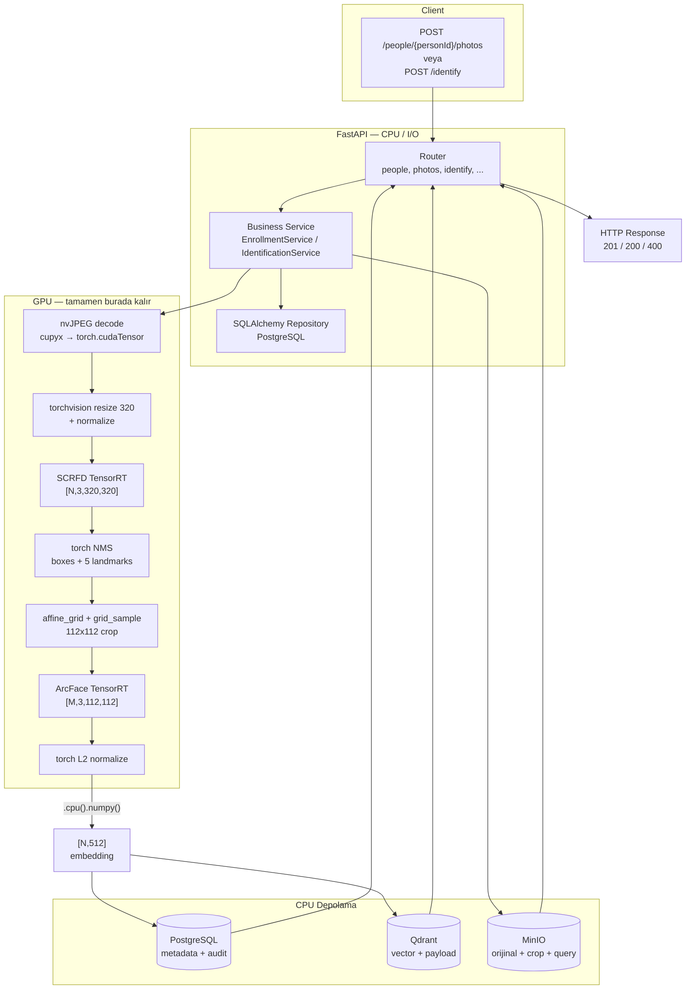

# Fastest Phase 1 Stack — End-to-End Flow

> Stack: `torch` + `torchvision` + `tensorrt` + `cupy`  
> CPU boundary: only final `[N,512]` embedding + metadata go to PostgreSQL / Qdrant / MinIO.

---

## 1. Full Request-to-Response Flow

---

## 2. GPU-Only Detail

```mermaid
flowchart LR
    A["JPEG bytes"] --> B["nvJPEG GPU decode"]
    B --> C["torchvision resize\n320x320 normalize"]
    C --> D["TensorRT SCRFD\nbatch inference"]
    D --> E["torch decode scores/bboxes\n+ batched NMS"]
    E --> F["5 landmark → affine\naffine_grid + grid_sample"]
    F --> G["TensorFace ArcFace\nbatch inference"]
    G --> H["torch L2 normalize"]
    H --> I["[N,512] embedding\nGPU memory"]
    I --> J[".cpu().numpy()\nsadece burada CPU'ya çıkar"]
```

---

## 3. Hız Hedefleri

| Veri | Süre | Throughput |
|---|---|---|
| LFW ~13K | ~1 dk | ≥ 220 img/s |
| 100K fotoğraf | ~10 dk | ≥ 167 img/s |
| 1M fotoğraf | ~90 dk | ≥ 185 img/s |

Gerçek rakamlar GPU, batch boyutu, disk/ağ hızına bağlıdır.
