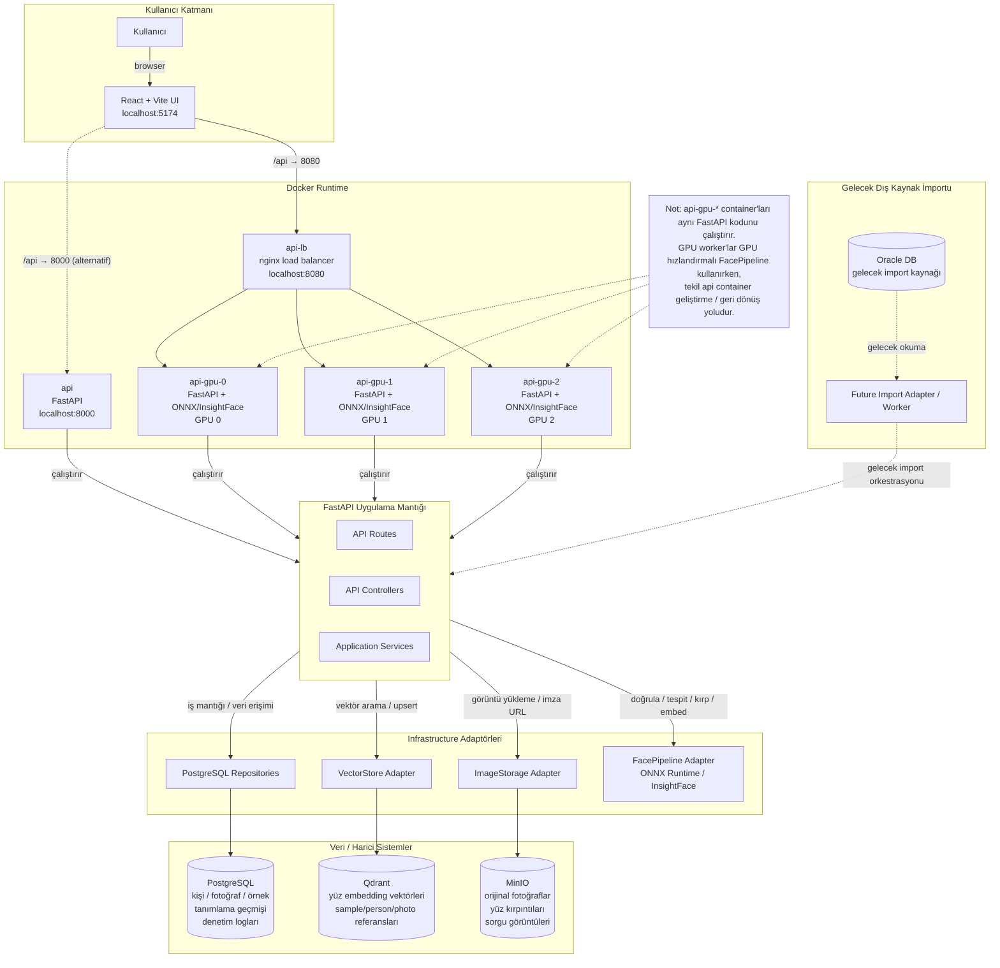

# High-Level Architecture

## Kısa Açıklama

- **Kullanıcı**: Tarayıcı üzerinden React + Vite arayüzüne erişir.
- **UI**: Vite dev sunucusu `localhost:5174`'te çalışır; `/api` ve `/media` isteklerini `localhost:8080`'deki nginx yük dengeleyicisine yönlendirir.
- **api-lb**: Üç GPU worker arasında round-robin trafik dağıtır.
- **api-gpu-0/1/2**: Aynı FastAPI uygulama kodunu çalıştıran GPU işlem container'ları; yüz doğrulama, tespit, kırpma ve embedding çıkarımını ONNX Runtime + InsightFace ile GPU üzerinde yapar.
- **api**: Tek-instance FastAPI container'ı `localhost:8000`; geliştirme, test veya geri dönüş amaçlı kullanılır.
- **PostgreSQL**: Kişiler, fotoğraflar, yüz örnekleri, tanımlama istekleri/sonuçları, sorgu yüzleri ve denetim logları için ilişkisel veri saklar.
- **Qdrant**: 512 boyutlu yüz embedding vektörlerini saklar ve kosinüs benzerliğiyle komşu araması yapar.
- **MinIO**: Orijinal fotoğraflar, yüz kırpıntıları ve isteğe bağlı sorgu görüntüleri için S3-benzeri nesne depolama sağlar.
- **Oracle / future import worker**: Sadece mimari vizyon; mevcut kodda veya Docker Compose'da gerçeklenmemiştir.
