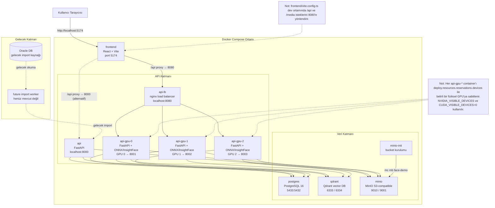

# Docker Compose Architecture

## Kısa Açıklama

- **frontend**: React + Vite geliştirme sunucusu; `localhost:5174` üzerinden çalışır.
- **api**: Tekil FastAPI uygulaması; `localhost:8000` üzerinden erişilir, geliştirme veya geri dönüş amaçlı kullanılır.
- **api-lb**: nginx yük dengeleyici; `/api` isteklerini üç GPU worker arasında dağıtır.
- **api-gpu-0/1/2**: ONNX Runtime + InsightFace yüz işleme hattı içeren FastAPI replikaları; her biri fiziksel bir GPU'ya sabitlenmiştir.
- **postgres**: Kişi, fotoğraf, örnek, tanımlama geçmişi ve denetim logları için ilişkisel veritabanı.
- **qdrant**: Yüz embedding vektörlerinin saklandığı vektör veritabanı.
- **minio**: Orijinal fotoğraf, yüz kırpıntıları ve sorgu görüntülerinin saklandığı S3-benzeri nesne deposu.
- **minio-init**: Başlangıçta `face-demo` bucket'ını oluşturan tek seferlik init container'ı.
- **Oracle / future import worker**: Sadece mimari vizyon; mevcut kodda veya Docker Compose'da gerçeklenmemiştir.
