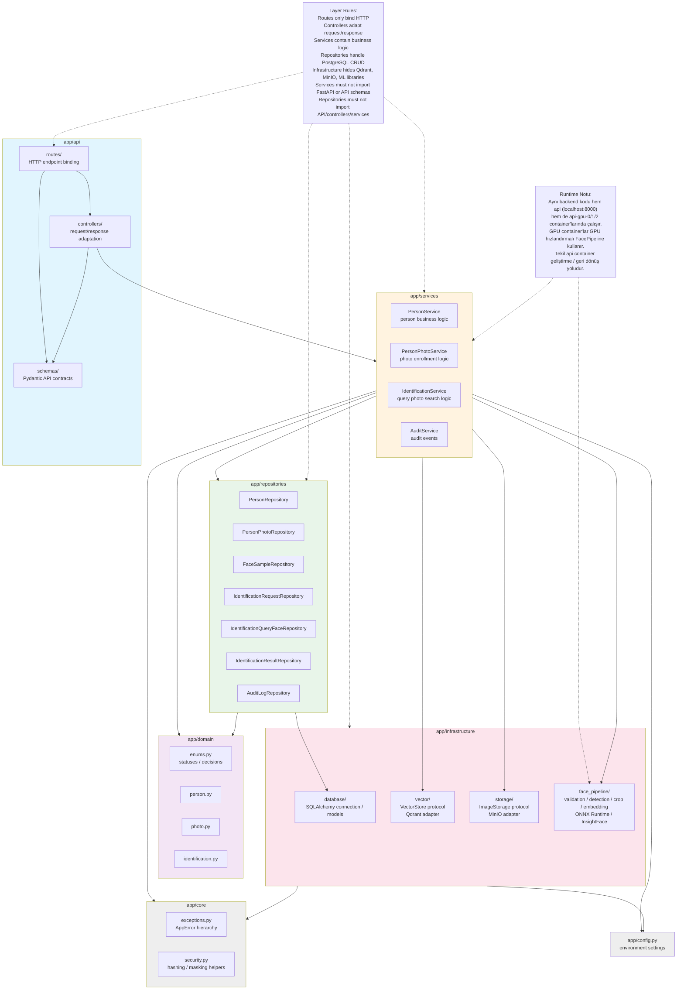

# Layered Backend Architecture

## Açıklama

- **API Layer**: FastAPI router'ları HTTP endpoint'leri bağlar, controller'lar request/response dönüşümünü yapar, Pydantic şemalar API sözleşmelerini tanımlar.
- **Services Layer**: İş mantığını barındırır. `PersonService`, `PersonPhotoService`, `IdentificationService`, `AuditService` mevcut servislerdir.
- **Domain Layer**: Temel domain modelleri ve enum'lar (`person.py`, `photo.py`, `identification.py`, `enums.py`).
- **Repositories**: PostgreSQL CRUD operasyonları. `PersonRepository`, `PersonPhotoRepository`, `FaceSampleRepository`, `IdentificationRequestRepository`, `IdentificationQueryFaceRepository`, `IdentificationResultRepository`, `AuditLogRepository` bulunur.
- **Infrastructure**: Protokol/adapter pattern. `VectorStore` → Qdrant, `ImageStorage` → MinIO, `FacePipeline` → ONNX Runtime + InsightFace, `database` → SQLAlchemy.
- **Core**: `AppError` hiyerarşisi ve güvenlik yardımcıları.
- **Runtime Notu**: Aynı backend kodu `api` (tek-instance) ve `api-gpu-0/1/2` (GPU replikaları) container'larında çalışır. GPU worker'lar `FACE_PIPELINE_BACKEND=gpu` ve `ONNXRUNTIME_PROVIDERS` ile GPU inference yapar.
- **Eksik Future Bileşenler**: `ImportService`, `ImportJobRepository`, `ImportJobItemRepository` ve `import_job.py` domain modeli mevcut kodda yoktur; sadece gelecek Oracle import vizyonunda yer alır.
