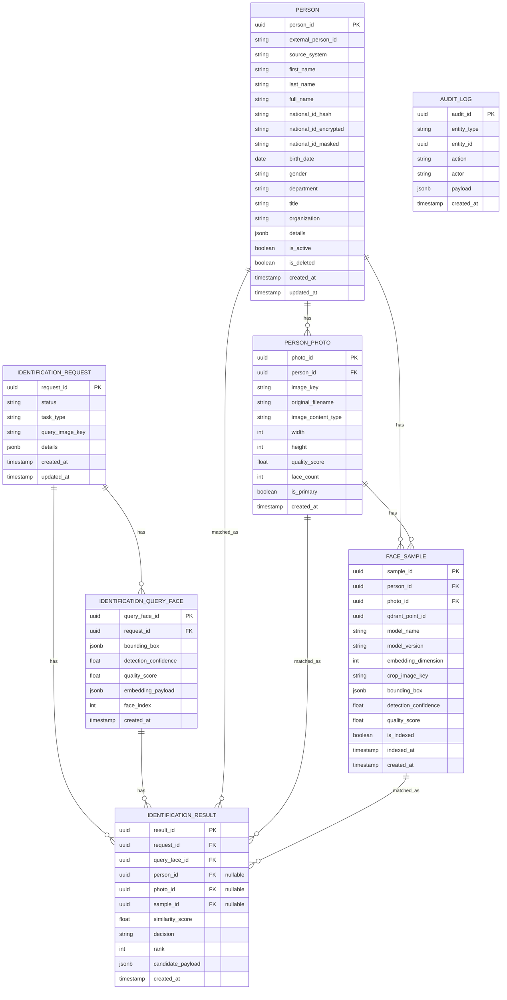

# Database ERD

## Notes

- `PERSON`: kişi/business bilgileri.
- `PERSON_PHOTO`: kişiye ait orijinal fotoğraf metadata’sı. Fotoğraf dosyası MinIO’da durur.
- `FACE_SAMPLE`: fotoğraftan çıkarılmış yüz sample metadata’sı. Embedding vektörü Qdrant’ta durur; PostgreSQL sadece `qdrant_point_id` referansını tutar.
- `IDENTIFICATION_REQUEST`: her identify/search işleminin trace kaydı. Her response `requestId` döndürür.
- `IDENTIFICATION_QUERY_FACE`: sorgu fotoğrafında tespit edilen yüzler. Multiple face durumunu izlemek için gerekli.
- `IDENTIFICATION_RESULT`: Qdrant’tan gelen top-k adayların ve final decision’ın kalıcı sonucu.
- `AUDIT_LOG`: person create, photo enrollment, delete/update gibi önemli operasyonların güvenli audit kaydı.

> Bulk import / Oracle import ileride ayrı bir future scope olarak ele alınabilir. Gerekirse `import_job` ve `import_job_item` tabloları sonradan eklenir. MVP’de kullanıcılar manuel kişi oluşturur ve kişiye fotoğraf enroll eder.
