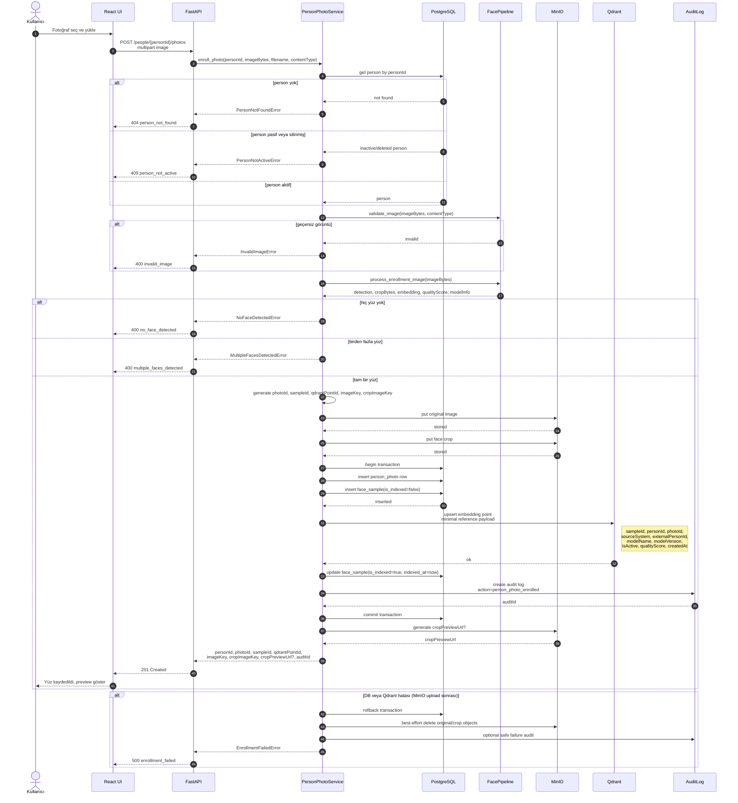

# Enrollment Sequence

```mermaid
sequenceDiagram
    autonumber
    actor U as Kullanıcı
    participant UI as React UI
    participant API as FastAPI
    participant Svc as PersonPhotoService
    participant DB as PostgreSQL
    participant FP as FacePipeline
    participant St as MinIO
    participant Vec as Qdrant
    participant Audit as AuditLog

    U->>UI: Fotoğraf seç ve yükle
    UI->>API: POST /people/{personId}/photos<br/>multipart image
    API->>Svc: enroll_photo(personId, imageBytes, filename, contentType)

    Svc->>DB: get person by personId
    alt person yok
        DB-->>Svc: not found
        Svc-->>API: PersonNotFoundError
        API-->>UI: 404 person_not_found
    else person pasif veya silinmiş
        DB-->>Svc: inactive/deleted person
        Svc-->>API: PersonNotActiveError
        API-->>UI: 409 person_not_active
    else person aktif
        DB-->>Svc: person
    end

    Svc->>FP: validate_image(imageBytes, contentType)
    alt geçersiz görüntü
        FP-->>Svc: invalid
        Svc-->>API: InvalidImageError
        API-->>UI: 400 invalid_image
    end

    Svc->>FP: process_enrollment_image(imageBytes)
    FP-->>Svc: detection, cropBytes, embedding, qualityScore, modelInfo

    alt hiç yüz yok
        Svc-->>API: NoFaceDetectedError
        API-->>UI: 400 no_face_detected
    else birden fazla yüz
        Svc-->>API: MultipleFacesDetectedError
        API-->>UI: 400 multiple_faces_detected
    else tam bir yüz
        Svc->>Svc: generate photoId, sampleId, qdrantPointId, imageKey, cropImageKey

        Svc->>St: put original image
        St-->>Svc: stored
        Svc->>St: put face crop
        St-->>Svc: stored

        Svc->>DB: begin transaction
        Svc->>DB: insert person_photo row
        Svc->>DB: insert face_sample(is_indexed=false)
        DB-->>Svc: inserted

        Svc->>Vec: upsert embedding point<br/>minimal reference payload
        note right of Vec: sampleId, personId, photoId,<br/>sourceSystem, externalPersonId,<br/>modelName, modelVersion,<br/>isActive, qualityScore, createdAt
        Vec-->>Svc: ok

        Svc->>DB: update face_sample(is_indexed=true, indexed_at=now)
        Svc->>Audit: create audit log<br/>action=person_photo_enrolled
        Audit-->>Svc: auditId
        Svc->>DB: commit transaction

        Svc->>St: generate cropPreviewUrl?
        St-->>Svc: cropPreviewUrl

        Svc-->>API: personId, photoId, sampleId, qdrantPointId,<br/>imageKey, cropImageKey, cropPreviewUrl?, auditId
        API-->>UI: 201 Created
        UI-->>U: Yüz kaydedildi, preview göster
    end

    alt DB veya Qdrant hatası (MinIO upload sonrası)
        Svc->>DB: rollback transaction
        Svc->>St: best-effort delete original/crop objects
        Svc->>Audit: optional safe failure audit
        Svc-->>API: EnrollmentFailedError
        API-->>UI: 500 enrollment_failed
    end
```
