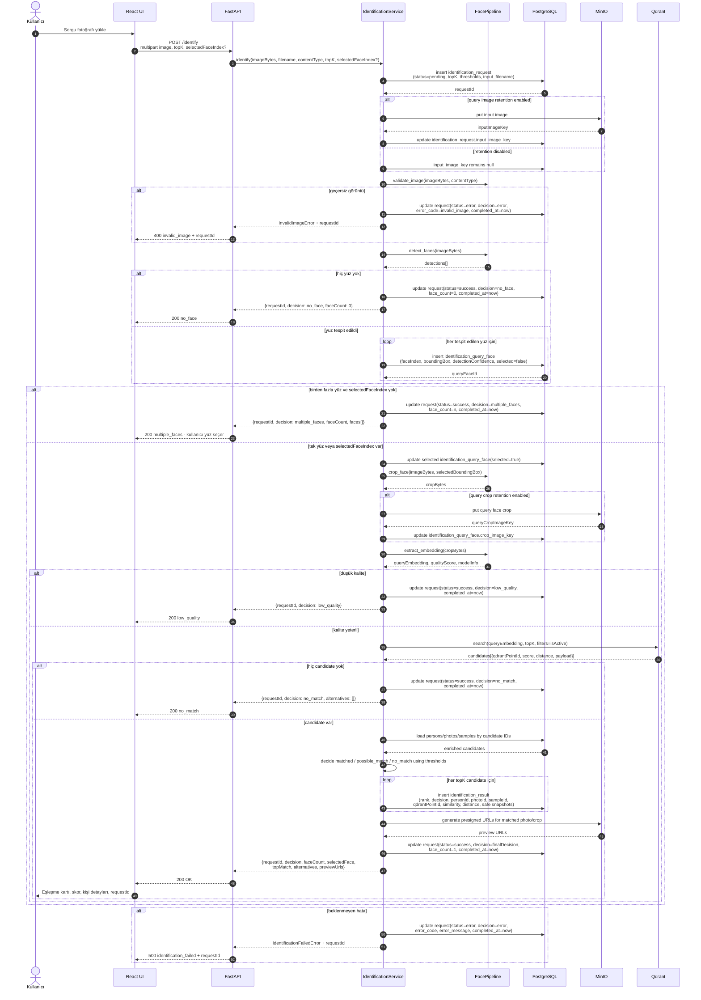

# Identification Sequence

```mermaid
sequenceDiagram
    autonumber
    actor U as Kullanıcı
    participant UI as React UI
    participant API as FastAPI
    participant Svc as IdentificationService
    participant FP as FacePipeline
    participant DB as PostgreSQL
    participant St as MinIO
    participant Vec as Qdrant

    U->>UI: Sorgu fotoğrafı yükle
    UI->>API: POST /identify<br/>multipart image, topK, selectedFaceIndex?
    API->>Svc: identify(imageBytes, filename, contentType, topK, selectedFaceIndex?)

    Svc->>DB: insert identification_request<br/>(status=pending, topK, thresholds, input_filename)
    DB-->>Svc: requestId

    alt query image retention enabled
        Svc->>St: put input image
        St-->>Svc: inputImageKey
        Svc->>DB: update identification_request.input_image_key
    else retention disabled
        Svc->>DB: input_image_key remains null
    end

    Svc->>FP: validate_image(imageBytes, contentType)
    alt geçersiz görüntü
        Svc->>DB: update request(status=error, decision=error,<br/>error_code=invalid_image, completed_at=now)
        Svc-->>API: InvalidImageError + requestId
        API-->>UI: 400 invalid_image + requestId
    end

    Svc->>FP: detect_faces(imageBytes)
    FP-->>Svc: detections[]

    alt hiç yüz yok
        Svc->>DB: update request(status=success, decision=no_face,<br/>face_count=0, completed_at=now)
        Svc-->>API: {requestId, decision: no_face, faceCount: 0}
        API-->>UI: 200 no_face
    else yüz tespit edildi
        loop her tespit edilen yüz için
            Svc->>DB: insert identification_query_face<br/>(faceIndex, boundingBox, detectionConfidence, selected=false)
            DB-->>Svc: queryFaceId
        end
    end

    alt birden fazla yüz ve selectedFaceIndex yok
        Svc->>DB: update request(status=success, decision=multiple_faces,<br/>face_count=n, completed_at=now)
        Svc-->>API: {requestId, decision: multiple_faces, faceCount, faces[]}
        API-->>UI: 200 multiple_faces - kullanıcı yüz seçer
    else tek yüz veya selectedFaceIndex var
        Svc->>DB: update selected identification_query_face(selected=true)
        Svc->>FP: crop_face(imageBytes, selectedBoundingBox)
        FP-->>Svc: cropBytes

        alt query crop retention enabled
            Svc->>St: put query face crop
            St-->>Svc: queryCropImageKey
            Svc->>DB: update identification_query_face.crop_image_key
        end

        Svc->>FP: extract_embedding(cropBytes)
        FP-->>Svc: queryEmbedding, qualityScore, modelInfo

        alt düşük kalite
            Svc->>DB: update request(status=success, decision=low_quality,<br/>completed_at=now)
            Svc-->>API: {requestId, decision: low_quality}
            API-->>UI: 200 low_quality
        else kalite yeterli
            Svc->>Vec: search(queryEmbedding, topK, filters=isActive)
            Vec-->>Svc: candidates[{qdrantPointId, score, distance, payload}]

            alt hiç candidate yok
                Svc->>DB: update request(status=success, decision=no_match,<br/>completed_at=now)
                Svc-->>API: {requestId, decision: no_match, alternatives: []}
                API-->>UI: 200 no_match
            else candidate var
                Svc->>DB: load persons/photos/samples by candidate IDs
                DB-->>Svc: enriched candidates
                Svc->>Svc: decide matched / possible_match / no_match using thresholds

                loop her topK candidate için
                    Svc->>DB: insert identification_result<br/>(rank, decision, personId, photoId, sampleId,<br/>qdrantPointId, similarity, distance, safe snapshots)
                end

                Svc->>St: generate presigned URLs for matched photo/crop
                St-->>Svc: preview URLs

                Svc->>DB: update request(status=success, decision=finalDecision,<br/>face_count=1, completed_at=now)
                Svc-->>API: {requestId, decision, faceCount, selectedFace,<br/>topMatch, alternatives, previewUrls}
                API-->>UI: 200 OK
                UI-->>U: Eşleşme kartı, skor, kişi detayları, requestId
            end
        end
    end

    alt beklenmeyen hata
        Svc->>DB: update request(status=error, decision=error,<br/>error_code, error_message, completed_at=now)
        Svc-->>API: IdentificationFailedError + requestId
        API-->>UI: 500 identification_failed + requestId
    end
```
