# UI Wireflow

```mermaid
flowchart TB
    Dashboard["Dashboard<br/>people / photos / samples stats<br/>recent identification requests"]
    PeopleList["People List<br/>list, search, filter people"]
    CreatePerson["Create Person<br/>basic fields + optional details JSON"]
    PersonDetail["Person Detail<br/>person data + enrolled photos + samples"]
    AddPhoto["Add Photo / Enroll Face<br/>upload, detect, crop, quality, enroll"]
    IdentifyPhoto["Identify Photo<br/>upload query photo, detect face, search"]
    IdentifyHistory["Identification Request History<br/>past searches by requestId"]
    IdentifyDetail["Identification Request Detail<br/>single request details and results"]
    ImportDemo["Import Demo Data<br/>Future / optional helper<br/>not core MVP"]

    Dashboard --> PeopleList
    Dashboard --> CreatePerson
    Dashboard --> IdentifyPhoto
    Dashboard --> IdentifyHistory
    Dashboard -.-> ImportDemo

    PeopleList --> PersonDetail
    PeopleList --> CreatePerson
    CreatePerson -->|created personId| PersonDetail

    PersonDetail --> AddPhoto
    AddPhoto -->|enrollment success<br/>photoId + sampleId| PersonDetail
    PersonDetail --> IdentifyPhoto

    IdentifyPhoto -->|requestId| IdentifyDetail
    IdentifyHistory --> IdentifyDetail
    IdentifyDetail -->|matched personId| PersonDetail

    subgraph AddPhotoComponents["Add Photo / Enroll Face Components"]
        EnrollUpload["Upload Area<br/>select image"]
        EnrollPreview["Image Preview"]
        EnrollBBox["Detected Face Bounding Box"]
        EnrollCrop["Face Crop Preview"]
        EnrollQuality["Quality Score"]
        EnrollErrors["Validation Errors<br/>invalid_image / no_face / multiple_faces"]
        EnrollResult["Enrollment Result<br/>photoId, sampleId, qdrantPointId,<br/>auditId?"]
    end

    AddPhoto --- EnrollUpload
    AddPhoto --- EnrollPreview
    AddPhoto --- EnrollBBox
    AddPhoto --- EnrollCrop
    AddPhoto --- EnrollQuality
    AddPhoto --- EnrollErrors
    AddPhoto --- EnrollResult

    subgraph IdentifyPhotoComponents["Identify Photo Page Components"]
        Upload["Upload Area<br/>drag-drop or file picker"]
        Preview["Preview<br/>uploaded query image"]
        Loading["Loading State<br/>detecting / searching"]
        BBox["Detected Bounding Box<br/>selected query face"]
        FaceChoice["Multiple Face Choice<br/>choose face by faceIndex"]
        NoFace["No Face State"]
        LowQuality["Low Quality State"]
        NoMatch["No Match State"]
        TopMatch["Top Match Card<br/>matched / possible match"]
        Score["Similarity Score"]
        PersonDetails["Safe Person Details<br/>fullName, department, title,<br/>organization, nationalIdMasked,<br/>optional details preview"]
        MatchedPhoto["Matched Enrolled Photo / Crop"]
        RequestId["RequestId<br/>trace identifier"]
        Alternatives["Top-K Alternatives"]
        LinkToDetail["Link to Request Detail / History"]
    end

    IdentifyPhoto --- Upload
    IdentifyPhoto --- Preview
    IdentifyPhoto --- Loading
    IdentifyPhoto --- BBox
    IdentifyPhoto --- FaceChoice
    IdentifyPhoto --- NoFace
    IdentifyPhoto --- LowQuality
    IdentifyPhoto --- NoMatch
    IdentifyPhoto --- TopMatch
    IdentifyPhoto --- Score
    IdentifyPhoto --- PersonDetails
    IdentifyPhoto --- MatchedPhoto
    IdentifyPhoto --- RequestId
    IdentifyPhoto --- Alternatives
    IdentifyPhoto --- LinkToDetail
```

## Notes

- **Raw national ID** asla UI'da gösterilmez. UI'da sadece `nationalIdMasked` görünür.
- **`person.details`**: demo için JSON/key-value preview gösterilebilir, ancak production'da allowlist veya masking ile sınırlandırılmalıdır.
- **Import Demo Data**: core MVP değildir; sadece gelecekteki/opsiyonel demo helper olarak düşünülmelidir.
- **Identify result card'larındaki kişi bilgileri** PostgreSQL enrichment sonucu gösterilir, doğrudan Qdrant payload'dan gelen detaylar değildir.
